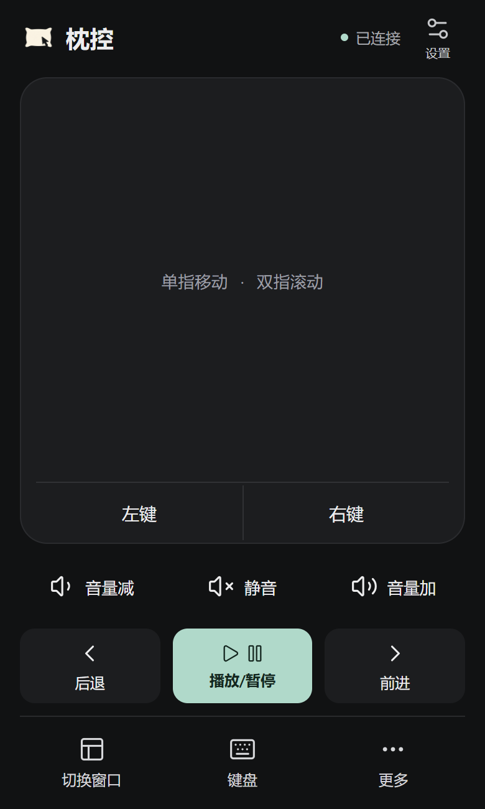
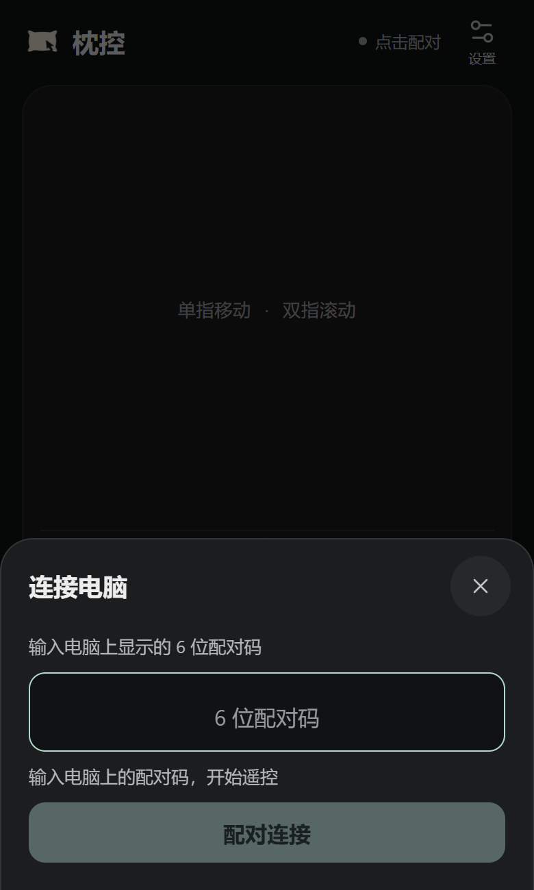
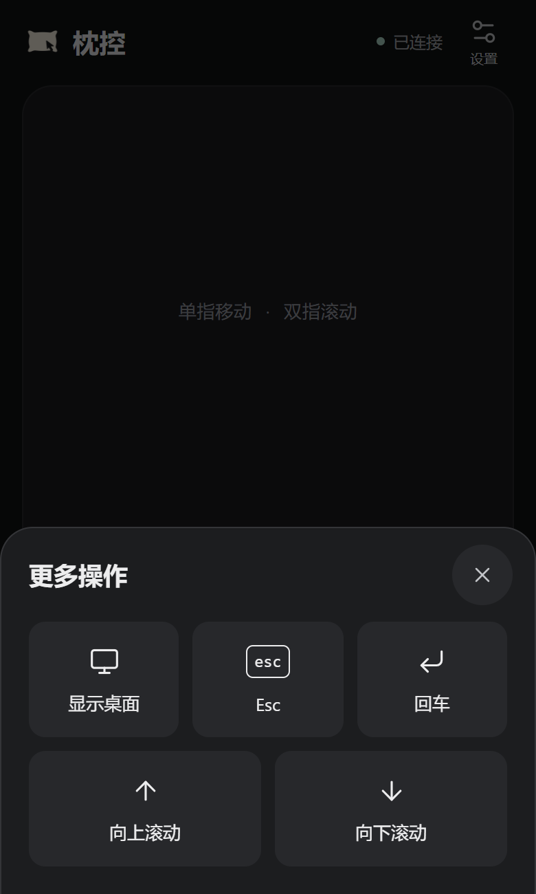

<p align="center"></p>
<h1 align="center">枕控 PillowControl</h1>
<p align="center"><strong>Turn your phone into a LAN touchpad and remote for your PC.</strong></p>
<p align="center"><a href="README.md">中文</a> · English</p>
<p align="center"><a href="https://github.com/RedWait/pillow-control/releases/latest">Download</a> · <a href="#quick-start">Quick start</a> · <a href="#preview">Preview</a></p>
<p align="center">
  <a href="https://github.com/RedWait/pillow-control/releases/latest"></a>
  <a href="LICENSE"></a>
  
</p>

Watching a show from bed? Use your phone to move the PC mouse, change the volume, and type without getting up. Open the remote in your phone browser—no mobile app required. The picture stays on your PC monitor; PillowControl does not stream the screen.

<a id="preview"></a>
## A look at PillowControl

<p align="center"></p>
<p align="center"><em>Everyday controls on one screen. Text input and other tools open when needed.</em></p>
<p align="center"></p>

> Screenshots show the v0.2.1 interface, rendered from the actual pages with preview connection data. Address `192.0.2.10` and code `123456` are demonstration values, not connection credentials. Phone screenshots use a browser viewport and are not physical-device acceptance evidence.

<details>
<summary>Pairing and additional controls</summary>
<p>
  
  
</p>
</details>

## Why PillowControl?

- **Just a phone browser.** Connect over your local network, with no mobile app or cloud account.
- **A touchpad in your hand.** Relative movement, taps, double taps, left/right click, two-finger scrolling, and adjustable sensitivity.
- **Volume and playback shortcuts.** Control system volume and mute, or send Space and arrow keys.
- **Chinese and English text input.** Type at the PC's current cursor position without reading or changing its clipboard. Unsent drafts survive closing the panel.
- **Cycle through windows.** Keep Alt held while choosing a window, then confirm to release it. Show Desktop is also available.
- **Pair once, reconnect later.** The same browser and URL can reconnect after a PC application restart. Optional silent startup runs after Windows sign-in.

<a id="download"></a>
## Download

**[Download from GitHub Releases](https://github.com/RedWait/pillow-control/releases/latest)** · [v0.2.1 release notes](https://github.com/RedWait/pillow-control/releases/latest)

| Package | Best for | WebView2 |
| --- | --- | --- |
| **[EXE installer (recommended)](https://github.com/RedWait/pillow-control/releases/download/v0.2.1/pillow-control-0.2.1-setup-x64.exe)** | Everyday use; installs for the current Windows user | Includes the offline installer, so the download is larger |
| [Portable ZIP](https://github.com/RedWait/pillow-control/releases/download/v0.2.1/pillow-control-0.2.1-portable-x64.zip) | Extract and run; manage the folder yourself | Requires an existing WebView2 Runtime |

Verify downloads with the [SHA-256 checksums](https://github.com/RedWait/pillow-control/releases/download/v0.2.1/pillow-control-0.2.1-SHA256SUMS.txt). There is no separate offline edition: the EXE installer already bundles the offline WebView2 installer. Portable preferences still live in the current user's application-data folder; keep the executable path unchanged when using startup at sign-in.

Targets **Windows 10/11 x64**; currently tested on Windows 11. Windows 10, clean systems, and installation without an existing WebView2 Runtime still need acceptance testing. Packages are unsigned, so Windows may show an unknown publisher. End users do not need Node.js, Python, Rust, or build tools.

Internet access is needed to download the package. The EXE installer does not need to download WebView2 online. Portable users without that runtime must install it separately, which may require internet access. Everyday remote control only needs the LAN.

<a id="quick-start"></a>
## Quick start

1. **Launch PillowControl on the PC.** Install or extract it, then find the QR code and six-digit pairing code.
2. **Join the same network.** Connect your phone to home Wi-Fi; the PC may use Wi-Fi or Ethernet. Scan the QR code and open it in a browser.
3. **Pair the first time.** Enter the code currently shown on the PC.
4. **Control from your phone.** Move the pointer, adjust volume, or open the keyboard panel. Closing the desktop window leaves the app running in the tray.

The first pairing enables silent startup after Windows sign-in by default. You can disable it on the PC; later pairing will respect that choice. Stopping the service, quitting, or restarting the PC preserves pairing. Explicit revocation or re-pairing cancels the previous credential. See [automatic connection and startup](docs/AUTOCONNECT.md) (Chinese).

## FAQ and boundaries

**Can the PC use Ethernet?** Yes. Both devices should connect to the same router and be able to reach each other. Guest Wi-Fi, AP isolation, or separate VLANs can block access.

**The page will not open.** Check that the PC service is running and the correct address is selected. Allow only private networks in the firewall. Stop the service before changing adapters. [Troubleshooting](docs/TROUBLESHOOTING.md) (Chinese) covers ports, address changes, and firewall setup.

**Why do playback buttons sometimes do nothing?** Play/Pause sends Space; Back/Forward send the arrow keys. They depend on the focused PC window and player support. There is no playback-state feedback or universal Next Episode command; use the pointer to click the player instead.

**What happens when the phone app goes into the background?** Returning to the page reconnects automatically, without replaying old clicks, keys, or text. Only one control page is active at a time; another page may take over. Clearing browser data, changing browser or address, or revoking access may require pairing again.

**Can it control every window?** UAC secure desktop, the lock screen, and elevated windows are outside the supported scope. The app does not run as administrator by default. Text input depends on the target application's Unicode-input support.

**Is LAN traffic encrypted?** **No.** HTTP/WS carries pairing information and controls in plaintext. Use only on a trusted home LAN; do not expose it through public port forwarding or tunnels. Pairing is not transport encryption. Read the [security design](docs/SECURITY.md) (Chinese).

## For developers

The desktop uses **Tauri 2 and Rust**, with **Vue 3 and TypeScript** for both interfaces. The phone pairs over HTTP and sends allowlisted WebSocket commands. The Rust LAN service validates them and calls Windows APIs. Pages are embedded in the executable. The phone does not call Tauri APIs; the desktop uses restricted commands to manage the same service.

Development requires Windows x64, Node.js 22.12+, Rust MSVC (tested with 1.98.1), Microsoft C++ Build Tools with MSVC and Windows SDK, and WebView2.

```powershell
git clone https://github.com/RedWait/pillow-control.git
cd pillow-control
npm ci
npm run dev
```

```powershell
npm run typecheck
npm test
npm run build   # Build the local EXE
npm run pack    # Build installer, portable ZIP and checksums
```

Fetching dependencies and packaging tools for the first time needs internet access. Pages are built before launch; run `npm run dev` again after editing Vue files.

Detailed documents are currently in Chinese:

- [Development, architecture, testing and packaging](docs/DEVELOPMENT.md)
- [Windows verification](docs/VALIDATION.md) · [Device acceptance checklist](docs/ACCEPTANCE.md)
- [UI refinement and validation scope](docs/UI_POLISH.md) · [Mobile UI checks](docs/MOBILE_UI.md)
- [Pointer locator halo: usage and validation (unreleased, Chinese)](docs/POINTER_HALO.md)
- [Unreleased local changes: Backspace, scrolling, pointer magnifier and shutdown](docs/REMOTE_ENHANCEMENTS.md) (Chinese)
- [Migration and recoverable baseline](docs/MIGRATION.md)

Browser simulation, automated tests, and successful builds do not establish acceptance on physical phones, real Wi-Fi networks, or clean Windows systems.

## Contributing and license

Report bugs and suggestions in [Issues](https://github.com/RedWait/pillow-control/issues). Include the version, Windows and phone-browser details, reproduction steps, and expected behavior. Remove pairing codes, tokens, and personal information from screenshots and logs.

Discuss larger changes first. In pull requests, describe the changes and what you tested. Preserve command allowlists, authentication, disconnect cleanup, and the no-replay behavior. See [Contributing](CONTRIBUTING.md).

Licensed under the [MIT License](LICENSE). Dependency and distribution notices are in [THIRD_PARTY_NOTICES.md](THIRD_PARTY_NOTICES.md).

### Software updates

Desktop settings provide manual checks and an optional startup check. Installed builds require a verified signature and explicit confirmation before installation; portable builds link to Releases for manual replacement. The first updater-enabled release must be installed manually. See [update setup, publishing and acceptance limits](docs/UPDATES.md).
